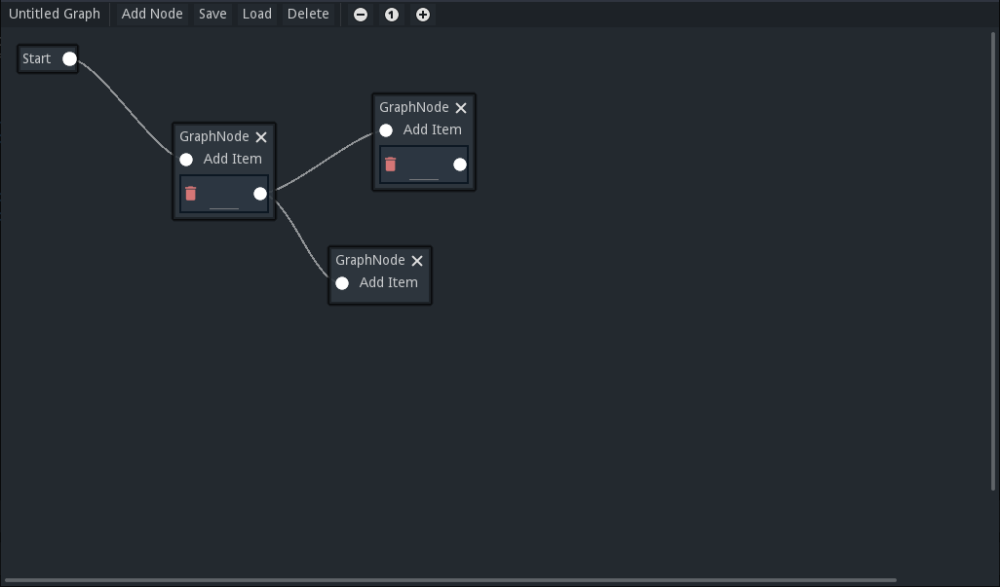

# Palco's Graph Editor

# What is this?

I had this idea for a generic graph editor that could be used to easily create any tool to edit graph-based information. This is the implementation of that idea. 

# How does it work?

It has three main components: the **Graph**, that contain **Nodes**, that contain **Items**.

## Items

An item can represent any information you want. Be it a formulary, a label, a button, a transition etc. Items can connect to nodes.

## Nodes

A node is just a container for items. It can receive connections from items.

## Graph

Just as you would expect, it defines a start and contain all the Nodes.

# Can you elaborate?

Yes, of course. Next, a Top-down description of the implementation. But before that, I must clarify something. A graph has nodes and so does Godot. So, in order to avoid ambiguities, this document call a graph node *node* and a Godot node *Godot node*. Got it? A node is in the graph while a Godot node is in the Godot's Scene Tree. All right, let's go.

## PGE.gd

It has to be loaded as a Singleton with the autoload feature. It contains the relative paths to the other files so we don't create a lot of custom classes. This way you can change the files' positions at any time and update it in only one place. Take a look inside it. It won't bite.

## GraphEditor.tscn

It is the visual editor for a *Graph.gd* resource. It's a generic editor to be inherited so you make a more specific editor e. g. a dialogue tree editor or a state machine editor.

In order to do that, you can inherit it and change the exported variables from the Godot's editor inspector:

- **Graph Node Packed Scene:** the editor create nodes in it, but if you're doing your custom editor, you might want to have custom nodes. Here you set the GraphNode.tscn scene or a scene that inherits it.
- **Item Types:** a dictionary containing keys that represent an item type and values that represent the path to the GraphNodeItem.tscn scene or a scene that inherits from it.

You can inherit the GraphEditor's script and define *get_graph_data() → Dictionary* and *set_graph_data(data: Dictionary)* to be able to save custom data in the resource it will edit. This way this data will be saved along with the edited graph.

## GraphNode.tscn

It is only a container and has a MenuButton to choose items to be added to it. You can inherit and edit it's name and/or script.

## GraphNodeItem.tscn

If you are making a custom editor, inherit this scene to make as much items as you want. The simplest way to do it is putting new Godot node's as child of the Content Godot node and adding the new scene and it's type into the Graph Editor's Item Types. Also, you'll have to inherit the script and define get_item_data() and set_item_data(data) so your custom data will be on the graph resource when saved.

## Graph.gd

It inherits from Resource and has two variables: connections and data. **Connections** is a Dictionary and it's content has the following format:

    {
    	'GraphStart' : {
    		'editor_data' :{
    			*rect_position*
    		},
    		'start_node_name' : *sarting node name*,
    	},
    	*node_name* : {
    		'editor_data' : {
    			*data the editor needs to load and edit the node*
    		},
    		'items' : [
    			{
    				'type' : *item type,*
    				'editor_data' : {
    					...
    				},
    				'item_data' : {
    					*custom data to be exported*
    				},
    				'connections' : [
    					*the names of the nodes this item is connected*
    				]
    			}
    		]
    	},
    	...
    }

It is some sort of an adjacency list. It's important to note that it only contains data. It doesn't contain any object, class or resource, only data in the format of dictionaries and arrays of data types.

The key **GraphStart** has information about the initial Node of the Graph. 

**editor_data**  is an Dictionary containing all data that is relevant to the Graph Editor (we will get there) for loading and, you know, editing. But the concept of an editor_data Dictionary is used a lot.

The key **start_node_name**, just as you would expect, has the name of the initial node of the Graph.

The other connections' keys are the name of the nodes. They contain their editor_data (see [GraphNode.g](http://graphnode.gs)d's get_editor_data method to see the actual data it's in it) and an Array of items. Each **Item** has:

- Type: when creating an Item Scene inheriting from GraphNodeItem.tscn, you decide what is it's type (a String);
- Editor data;
- Item data: data you decide in the Item Scene script (that should inherit from GraphNodeItem.gd) it's content. You must overwrite the method get_item_data() and the method set_item_data(data) in order to define what information will be stored and how it will be loaded by the graph editor;
- Connections: an Array containing the names of the Nodes this item is connected to.

It is fairly simple. When you have a node's name you use it as key to look for it's data. It will contain all the items it has and the information YOU've put on them, so you can do whatever you want with it. Then, if this item has a connection, you'll be able to get the next node's name and repeat the process until you're done doing it. This way it's quite trivial to implement a generic parser for this format. Which I did.

## Parser.gd

With this parser you can use a node's items data to decide on which node to open next and get it's items data. Since the items can be connected to another node you can travel through this connections using the *next_node* method.

### Properties

graph: the current graph resource being parsed

current_node: the current node's name and key.

current_node_data: the current node's data in the format presented above.

### Methods

open_graph(graph_path: String) →bool

You pass the path to a Graph resource and it will load it and open the first node. Returns true if the graph was loaded and false if it fails.

close_graph() → void

Closes the current graph and free it from memory.

go_to_node(node_name: String) → bool

Open a node with the name *node_name.* Returns true if everything works and false if it fails.

next_node(item_id := 0, connection_id := 0) → String

Get the item with id *item_id* from the current_node_data and open the node from the connections array with id connection_id. Returns the new node name if everything works or an empty String if it doesn't.

reset_graph() → void

Goes back to the initial node.
