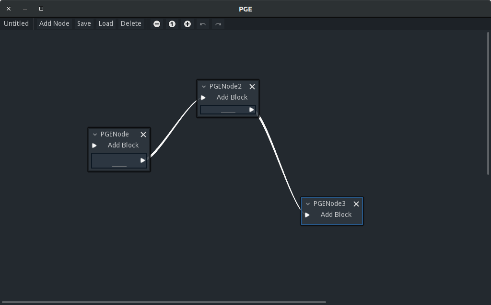

# Palco's Graph Editor

# What is this?

I had this idea for a generic graph editor that could be used to easily create any tool to edit graph-based information. This is the implementation of said idea.

# How does it work?

It has three main components: the `PGEGraph`s, that contain `PGENode`s, that contain `PGEBlock`s. In order to make a tool based on this implementation you'll need only what's in the *PGEBase* folder and autoload what is in the *autoload* folder.

## PGEBlock

A PGEBlock can represent any information you want. Be it a formulary, a label, a button, a transition etc. It can also have slots to connect it to a node.

## PGENode

A PGENode is just a container for blocks. It receives the connections.

## PGEGraph

Just as you would expect, it contain all the Nodes and their data.

# Can you elaborate?

Yes, of course. Next, a top-down description of the implementation.

## PGEEditor.tscn

It is the visual editor for a *PGEGraph.gd* resource. It's a generic editor to be inherited so you make a more specific editor e. g. a dialogue tree editor or a state machine editor.



In order to do that, you can inherit it and change the exported variables from the Godot's editor inspector:

- **Graph Class:** a file with the PGEGraph.gd script or a script that inherits it. This is the resource that the editor will, well, edit.
- **Pge Node Packed Scene:** the editor create nodes in it, but if you're doing your custom editor, you might want to have a custom node. Here you set the GraphNode.tscn scene or a scene that inherits it.
- **Scroll Sensibility:** the sensibility for scrolling the panel

## PGENode.tscn

It is only a container and has a MenuButton to choose blocks to be added to it. You have to inherit the scene and it's root script in order to add custom `PGEBLock` options. For that use the method `set_block_options(blocks_data: Array)`. It expects an array with the `PGEBlock`s information with the following format:

```GDScript
{
   text: String, # The text to be exhibited on MenuButton option
   scene_path: String # The block's res://path/to/pge_block.tsnc
}
```

## PGEBlock.tscn

If you are making a custom editor, inherit this scene to make as much `PGEBlock`s as you want. The simplest way to do it is putting new nodes as child of the `Content` node. Also, you'll have to inherit the script and overwrite `get_data() -> Dictionary` and `set_data(data: Dictionary)`. This way your custom data will be on the graph resource when saved.

You can define the variable `type` in the editor for optional categorization. This category will be used by PGEGraph to get the `PGEBlock`s of a `PGENode` by type. You can also set the number of slots it will have to connect to other `PGENode`s and some other options.

## PGEGraph.gd

It inherits from Resource and has two variables: nodes and current_node. `current_node` is a dictionary with the data of the current node, while `nodes` is also Dictionary and it's content has the following format:

```
	{
		'node_name': {
			'editor_data': Dictionary # position, size and other editor informations
			'blocks': [
				{
					'editor_data': Dictionary # filename, size and other editor informations
					'connections': Array, # If empty, it only carries data
					'type': String, # Optional categorization of the block, defaults to 'None'
					'data': Dictionary # data payload returned by get_data method
				},
				...
			]
		},
		...
	}
```

It is some sort of an adjacency dictionary. It's important to note that it only contains data. It doesn't contain any object, class or resource, only data in the format of dictionaries and arrays of built-in data types.

It is fairly simple. When you have a node's name you use it as key to look for it's data. It will contain all the items it has and the information you've put on them, so you can do whatever you want with it. Then, if the block has a connection, you'll be able to get the next node's name and repeat the process until you're done.

This class also has some methods to help traverse the graph.

> go_to(node_name: String) -> Dictionary

Pass the key and the node's data will be returned. It also updates `current_node` variable and make check's to ensure the key exists.

> get_blocks_by_type(node: = current_node) -> Dictionary

Get the data of the `PGEBlock`s of the current `PGENode` categorized by type. You can use `blocks_by_type[TypeName]` to get an `Array` of `PGEBlock` datas. A `PGEBlock` without a category specified will be on the **None** category.
